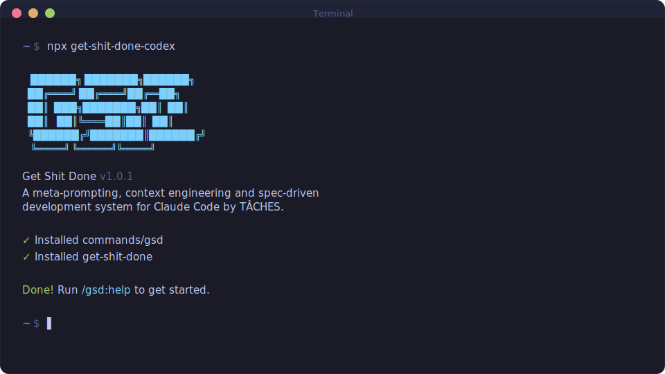

# Get Shit Done

**A meta-prompting, context engineering and spec-driven development system for Codex CLI by TÂCHES.**



Vibecoding has a bad reputation. You describe what you want, AI generates code, and you get inconsistent garbage that falls apart at scale.

GSD fixes that. It's the context engineering layer that makes Codex CLI reliable. Describe your idea, let the system extract everything it needs to know, and then let Codex CLI get to work.

THIS is how you vibecode and actually get shit done.

_Warning: Not for people who enjoy inconsistent and sloppy results._

---

## Installation

```bash
npx get-shit-done-cc
```

That's it. Works on Mac, Windows, and Linux.

Verify: `/prompts:gsd-help`

Local install note: run Codex with `CODEX_HOME=./.codex` if you installed locally.

---

## Codex CLI Wrapper (Experimental)

If you want to use Codex CLI for parallel codebase mapping, install this package and run:

```bash
get-shit-done-codex map-codebase
```

This wrapper spawns multiple `codex exec` runs in parallel to generate `.planning/codebase/`.

**Optional flags:**

- `--refresh` - delete and remap existing `.planning/codebase`
- `--update 1,3` - update specific groups
- `--concurrency 4` - cap parallel Codex runs
- `-- --model gpt-5.1-codex-max` - pass extra args to `codex exec`

---

## Why I Built This

I'm a solo developer. I don't write code — Codex CLI does.

Other spec-driven development tools exist; BMAD, Speckit... But they all seem to make things way more complicated than they need to be (sprint ceremonies, story points, stakeholder syncs, retrospectives, Jira workflows) or lack real big picture understanding of what you're building. I'm not a 50-person software company. I don't want to play enterprise theater. I'm just a creative person trying to build great things that work.

So I built GSD. The complexity is in the system, not in your workflow. Behind the scenes: context engineering, XML prompt formatting, subagent orchestration, state management. What you see: a few commands that just work.

I wanted to spend my time having ideas and seeing them through to implementation — not babysitting Codex. Now I can say "go," put it in YOLO mode, and go to the beach. The system gives Codex everything it needs to do the work _and_ verify it. I trust the workflow. It just does a good job.

That's what this is. No enterprise roleplay bullshit. Just an incredibly effective system for building cool stuff consistently using Codex CLI.

— TÂCHES

---

## How It Works

### 1. Start with an idea

```
/prompts:gsd-new-project
```

The system asks questions. Keeps asking until it has everything — your goals, constraints, tech preferences, edge cases. You go back and forth until the idea is fully captured. Creates **PROJECT.md**.

### 2. Create roadmap

```
/prompts:gsd-create-roadmap     # Create phases and state tracking
```

Roadmap creation produces:

- **ROADMAP.md** - Phases from start to finish
- **STATE.md** - Living memory that persists across sessions

### 3. Plan and execute phases

```
/prompts:gsd-plan-phase 1      # System creates atomic task plans
/prompts:gsd-execute-plan      # Subagent implements autonomously
```

Each phase breaks into 2-3 atomic tasks. Each task runs in a fresh subagent context — 200k tokens purely for implementation, zero degradation.

### 4. Ship and iterate

```
/prompts:gsd-complete-milestone   # Archive v1, prep for v2
/prompts:gsd-add-phase            # Append new work
/prompts:gsd-insert-phase 2       # Slip urgent work between phases
```

Ship your MVP in a day. Add features. Insert hotfixes. The system stays modular — you're never stuck.

---

## Existing Projects (Brownfield)

Already have code? Start here instead.

### 1. Map the codebase

```
get-shit-done-codex map-codebase
```

Runs parallel Codex CLI jobs to analyze your code. Creates `.planning/codebase/` with 7 documents:

Fallback (single-session): `/prompts:gsd-map-codebase`

- **STACK.md** — Languages, frameworks, dependencies
- **ARCHITECTURE.md** — Patterns, layers, data flow
- **STRUCTURE.md** — Directory layout, where things live
- **CONVENTIONS.md** — Code style, naming patterns
- **TESTING.md** — Test framework, patterns
- **INTEGRATIONS.md** — External services, APIs
- **CONCERNS.md** — Tech debt, known issues, fragile areas

### 2. Initialize project

```
/prompts:gsd-new-project
```

Same as greenfield, but the system knows your codebase. Questions focus on what you're adding/changing, not starting from scratch.

### 3. Continue as normal

From here, it's the same: `/prompts:gsd-create-roadmap` → `/prompts:gsd-plan-phase` → `/prompts:gsd-execute-plan`

The codebase docs load automatically during planning. Codex knows your patterns, conventions, and where to put things.

---

## Why It Works

### Context Engineering

Codex CLI is incredibly powerful _if_ you give it the context it needs. Most people don't.

GSD handles it for you:

| File         | What it does                                           |
| ------------ | ------------------------------------------------------ |
| `PROJECT.md` | Project vision, always loaded                          |
| `ROADMAP.md` | Where you're going, what's done                        |
| `STATE.md`   | Decisions, blockers, position — memory across sessions |
| `PLAN.md`    | Atomic task with XML structure, verification steps     |
| `SUMMARY.md` | What happened, what changed, committed to history      |
| `ISSUES.md`  | Deferred enhancements tracked across sessions          |

Size limits based on where Codex's quality degrades. Stay under, get consistent excellence.

### XML Prompt Formatting

Every plan is structured XML optimized for Codex:

```xml
<task type="auto">
  <name>Create login endpoint</name>
  <files>src/app/api/auth/login/route.ts</files>
  <action>
    Use jose for JWT (not jsonwebtoken - CommonJS issues).
    Validate credentials against users table.
    Return httpOnly cookie on success.
  </action>
  <verify>curl -X POST localhost:3000/api/auth/login returns 200 + Set-Cookie</verify>
  <done>Valid credentials return cookie, invalid return 401</done>
</task>
```

Precise instructions. No guessing. Verification built in.

### Subagent Execution

As Codex fills its context window, quality degrades. You've seen it: "Due to context limits, I'll be more concise now." That "concision" is code for cutting corners.

GSD prevents this. Each plan is maximum 3 tasks. Each plan runs in a fresh subagent — 200k tokens purely for implementation, zero accumulated garbage.

- Task 1: fresh context, full quality
- Task 2: fresh context, full quality
- Task 3: fresh context, full quality

No degradation. Walk away, come back to completed work.

### Clean Git History

Every task: atomic commit, clear message, summary documenting outcomes. Maintainable history you can trace.

### Modular by Design

- Add phases to current milestone
- Insert urgent work between phases
- Complete milestones and start fresh
- Adjust plans without rebuilding everything

You're never locked in. The system adapts.

---

## Commands

| Command                           | What it does                                                  |
| --------------------------------- | ------------------------------------------------------------- |
| `/prompts:gsd-new-project`                | Extract your idea through questions, create PROJECT.md        |
| `/prompts:gsd-create-roadmap`             | Create roadmap and state tracking                             |
| `/prompts:gsd-map-codebase`               | Map existing codebase (use `get-shit-done-codex map-codebase` for parallel) |
| `/prompts:gsd-plan-phase [N]`             | Generate task plans for phase                                 |
| `/prompts:gsd-execute-plan`               | Run plan via subagent                                         |
| `/prompts:gsd-progress`                   | Where am I? What's next?                                      |
| `/prompts:gsd-complete-milestone`         | Ship it, prep next version                                    |
| `/prompts:gsd-discuss-milestone`          | Gather context for next milestone                             |
| `/prompts:gsd-new-milestone [name]`       | Create new milestone with phases                              |
| `/prompts:gsd-add-phase`                  | Append phase to roadmap                                       |
| `/prompts:gsd-insert-phase [N]`           | Insert urgent work                                            |
| `/prompts:gsd-discuss-phase [N]`          | Gather context before planning                                |
| `/prompts:gsd-research-phase [N]`         | Deep ecosystem research for niche domains                     |
| `/prompts:gsd-list-phase-assumptions [N]` | See what Codex thinks before you correct it                  |
| `/prompts:gsd-pause-work`                 | Create handoff file when stopping mid-phase                   |
| `/prompts:gsd-resume-work`                | Restore from last session                                     |
| `/prompts:gsd-consider-issues`            | Review deferred issues, close resolved, identify urgent       |
| `/prompts:gsd-help`                       | Show all commands and usage guide                             |

---

## Who This Is For

People who want to vibecode and have it actually work.

Anyone who wants to clearly describe what they want, trust the system to build it, and go live their life.

Not for people who enjoy inconsistent and sloppy results.

---

## License

MIT License. See [LICENSE](LICENSE) for details.

---

**Codex CLI is powerful. GSD gives it the context and the systematic consistency to prove it.**
